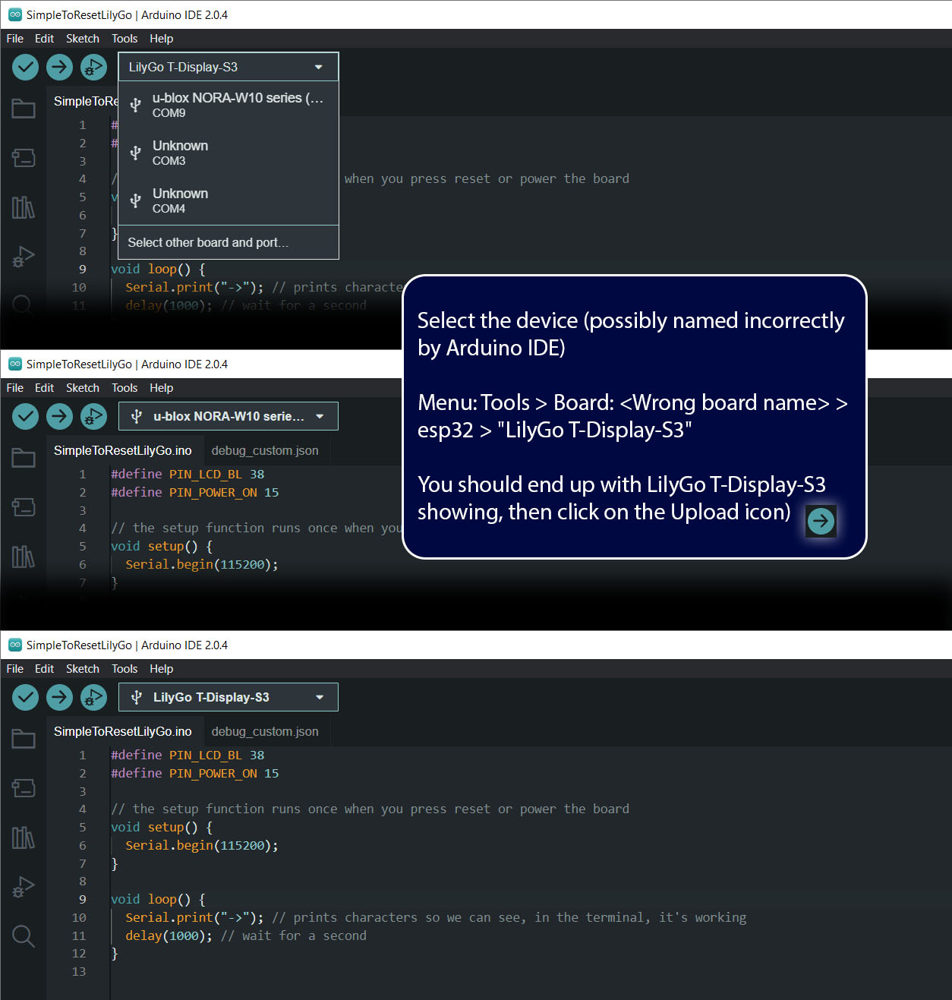
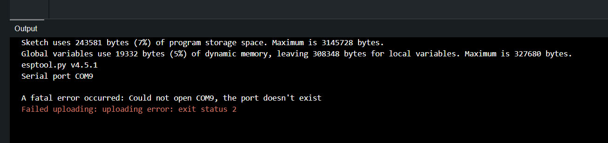
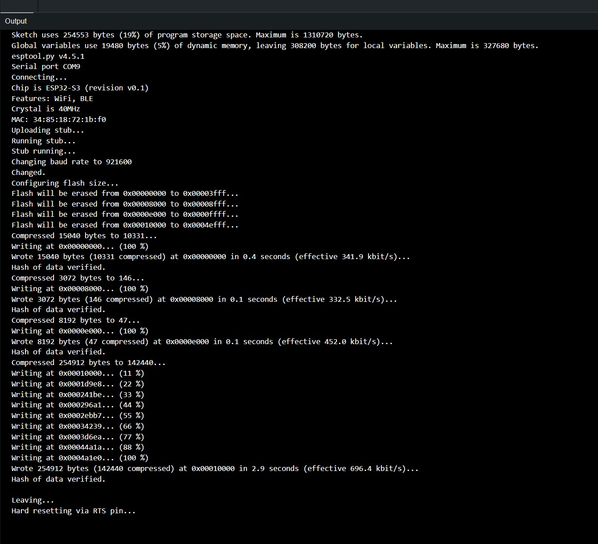
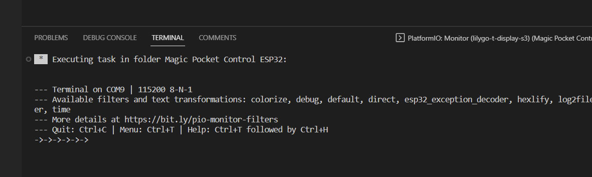
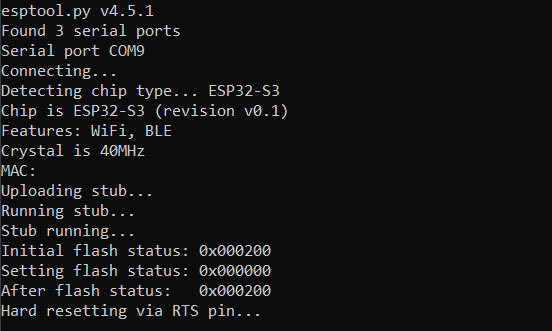

# :movie_camera: Magic Pocket Control for ESP32 devices
Blackmagic Design camera control on a LILYGO T-Display-S3, M5Stack M5StickC Plus, Freenove ESP32-S3-WROOM, or (hopefully) any other ESP32 device.

# Development and Device Tips

## Development Tips


## Device Tips

### :bricks: Bricked! Or just can't deploy a build.
Despite unplugging power and deploying a thousand times, I'm yet to actually brick one of the ESP32s. That's not to say you aren't fully capable of doing that or your devices do stop working for good!

Here are some tips if you can't deploy a build to your device.

#### LILYGO T-Display-S3, Freenove ESP32-S3-WROOM, and probably most ESP32 devices
If I've been developing for a while on these devices, regularly deploying builds to it, they can start to become less welcoming for a new build. (Once I left the T-Display-S3 on overnight and had to follow the below steps a number of times to revive it - useful to get these screenshots!)

Sometimes you'll try to deploy and it can't find the device or stops while writing partway with messages like "The chipped stopped responding" (that may look like this).


Then here are the steps I take to get it responsive to another deployment:
1. Unplug the USB-C cable and then plug it back in, try and deploy a build. If it doesn't work, continue to next step
2. Open Arduino IDE and follow the next steps

   

4. Re-select the board (Note: It may have identified it's a different device):
   - Click on the device drop-down at the top
   - Click on the relevant COM port, changing to the that COM port
   - Menu: Tools > Board: <Wrong board name> > esp32 > "LilyGo T-Display-S3"
   - Paste the following code into the editor and hit "Upload"
  
      ```
      #define PIN_LCD_BL 38 
      #define PIN_POWER_ON 15

      // the setup function runs once when you press reset or power the board
      void setup() {
        Serial.begin(115200);
      }

      void loop() {
        Serial.print("->"); // prints characters so we can see, in the terminal, it's working
        delay(1000); // wait for a second
      }
      ```
  
    - The above tries to deploy a simple program that prints a serial arrow every 1 second.
    - If it doesn't upload correctly, try a few more times. Unplug and replug the device if necessary.
   
      
   
    - If you still can't upload, unplug the USB-C, hold down the boot button and, while doing so, plug the USB-C cable back in, release the boot button after a few seconds.
    - If you've come this far and it's still not working, you may need to resort to using Espressif's Python scripts to flash the device, see the next section.
    - Additionally, try to reboot your computer (this has worked for me a number of times) and try again
    - Once you've successfully uploaded it, go back to Visual Studio Code and start the Serial Monitor

      $\color{green}{\textsf{Success}}$
      
    
    - If you see the serial messages "->->->"... coming through then you should be right to deploy a build to it (Note: Don't run Arduino IDE's Serial Monitor as it will block Visual Studio's one)

      $\color{green}{\textsf{Unbricked!}}$
      

    - If you've got here and it's still not working, I'm out of advice - except, unplug it, give it some time, reboot, try the Espressif approach below, and the above a few times. Athough I haven't bricked a device yet, it has taken a number of iterations at times. The best of luck!
  


Using Espressif's Python esptool to flash the device (Windows, I assume similar option for other OS's):
1. Ensure you have Python 3 on your computer (I use Anaconda and Anaconda Prompt)
2. Install as per [Espressif docs](https://docs.espressif.com/projects/esptool/en/latest/esp32/installation.html)
3. Plug your device in with the USB-C cable
4. In Anaconda Prompt run

```
python -m esptool write_flash_status --bytes 3 --non-volatile 0
```
  
5. You should see something like this:



6. Return to the steps regarding flashing the simple program through Arduino IDE
